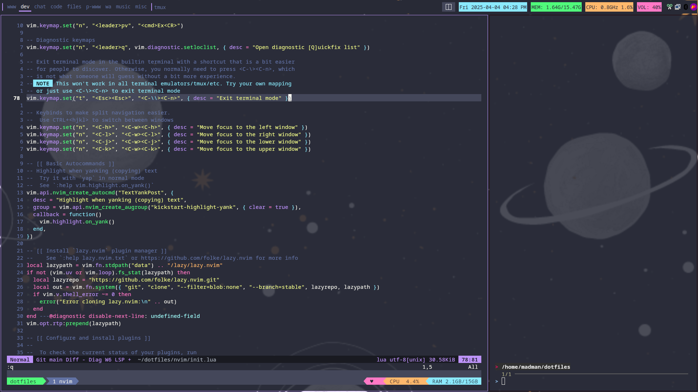

# Dotfiles
This repository contains my dotfiles and configuration files for various applications and tools I use. The goal is to have a consistent and portable setup across different machines.

## One Command Setup 💀💀
To install the dotfiles, run the following command in your terminal:

If you dont have `curl` installed, install it first:
```bash
sudo apt install curl -y
```

```bash
curl -L https://raw.githubusercontent.com/abdul-rehman-d/dotfiles/refs/heads/main/install.sh | bash
```



## Todo
- [ ] CLI Only functionality
